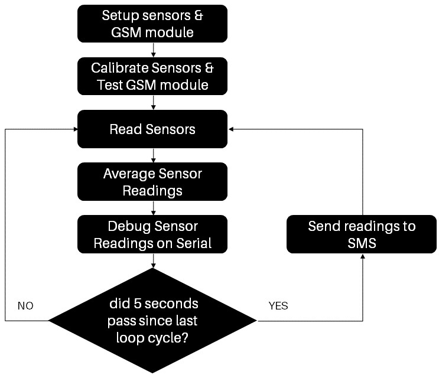

# PlantMo (Plant Monitoring Device)

**PlantMo** is an arduino-based plant monitoring device through acquiring real-time soil moisture levels, co2 levels, temperature & humidity, and light levels. The acquired data are transmitted to the owner via SMS text message. 

## Hardware

| Part | Function |
|--------------|---------|
| Arduino Pro Mini| Microcontroller |
| SIM900D | GSM module for SMS communication |
| LDR (Generic)  | Read light level `%` |
| DHT11          | Read temperature `°C` & humidity `%`| 
| MQ135          | Read carbon dioxide levels `PPM`    |
| Moisture Sensor | Read moisture level `%` |
| Solar Panel | Provide power to the system |
| 7805 Voltage Regulator | Regulate to 5v input supply |

## Schematic Diagram

## Software 

## Enclosure 
The device enclosure was designed in TinkerCad which the original design files can be accessed [here](https://www.tinkercad.com/things/fBq9YvFC2UN).

